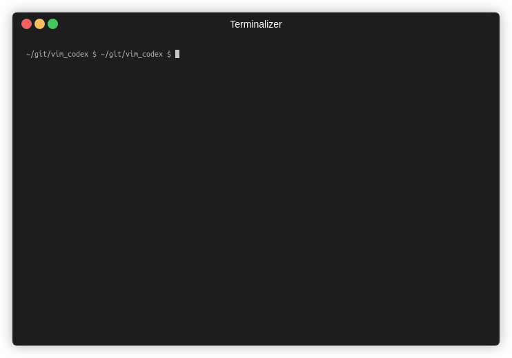

<h1 align="center">🤖 Vim Codex</h1>


<p align="center">
    <a href="https://github.com/tom-doerr/vim_codex/stargazers"
        ></a>
    <a href="https://github.com/tom-doerr/vim_codex/issues"
        ></a>
    <a href="https://github.com/tom-doerr/vim_codex/blob/main/LICENSE"
        ><br />
    <a href="https://github.com/tom-doerr/vim_codex/commits/main"
		></a>
    <a href="https://github.com/tom-doerr/vim_codex"
        ></a>
</p>



This is a simple plugin for Vim that will allow you to use OpenAI Codex.
To use this plugin you need to have access to OpenAI's [Codex API](https://openai.com/blog/openai-codex/).


## Installation

The easiest way to install the plugin is to install it as a bundle.
For example, using [Pathogen](https://github.com/tpope/vim-pathogen):

1. Get and install [pathogen.vim](https://github.com/tpope/vim-pathogen). You can skip this step
   if you already have it installed.

2. `cd ~/.vim/bundle`

3. `git clone git@github.com:tom-doerr/vim_codex.git`

Bundle installs are known to work fine also when using [Vundle](https://github.com/gmarik/vundle). Other
bundle managers are expected to work as well.


After installing the plugin, you need to install the openai package::
```
pip3 install openai
```

Finally add your OpenAI access information in 
`~/.vim/bundle/vim_codex/python/AUTH.py`.
You can find your authentication information on the [website](https://beta.openai.com/account/api-keys).


## Usage
The plugin provides a `CreateCompletion` command which you can call by default using the mapping 
`<Leader>co`.

To complete the current text from insert and normal mode using Ctrl+x, you can add the following
lines to your .vimrc::
```
nmap  <C-x> :CreateCompletion<CR>
imap  <C-x> <Esc>l:CreateCompletion<CR>i
```


## Updating

### Manually

In order to update the plugin, go to its bundle directory and use
Git to update it:

1. `cd ~/.vim/bundle/vim_codex`

2. `git pull`


### With Vundle

Use the `:BundleUpdate` command provided by Vundle, for example invoking
Vim like this::
```
% vim +BundleUpdate
```


